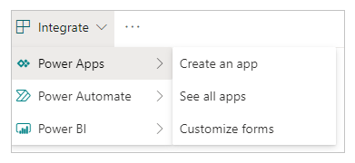
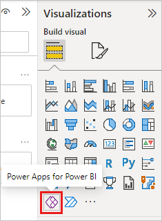
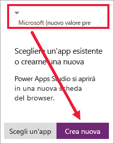
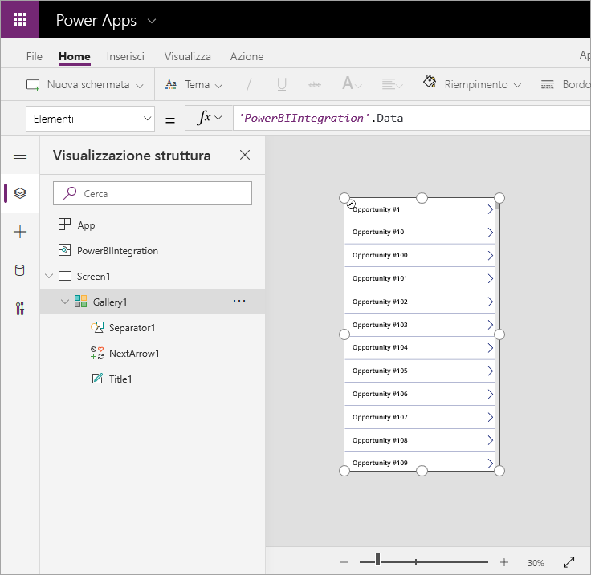
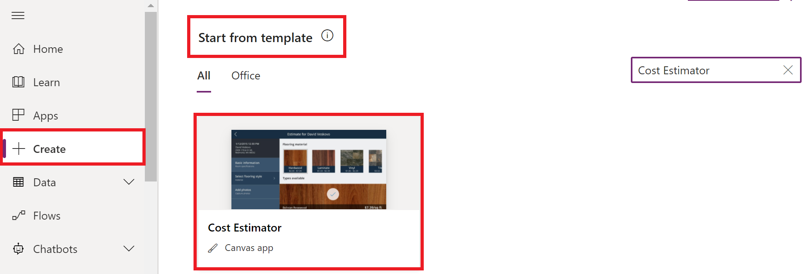
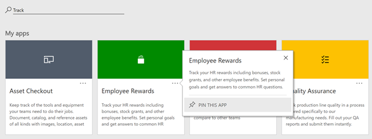
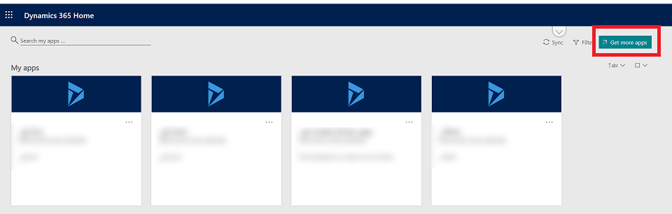

# Creazione Applicazioni

Power Apps è una piattaforma per lo sviluppo di app aziendali ad alta produttività e offre quattro componenti principali:

- **App canvas**
- **App basate su modello**
- **Schede**
- **Microsoft Dataverse**

### App Canvas

Le app canvas ti consentono di partire con la tua esperenza utente per sviluppare un'**interfaccia altamente personalizzata** utilizzando canvas vuote e collegandole a una gamma di oltre 200 origini dati. Le app canvas offrono la flessibilità necessaria per organizzare l'interfaccia e l'esperienza utente in base alle tue esigenze. 

Puoi iniziare a creare l'app dagli strumenti Microsoft in cui risiedono i tuoi dati, ad esempio:

- ### **Da un elenco di SharePoint**:
   1. In SharePoint Online, apri un elenco e quindi seleziona **Integra** > **Power Apps** > **Crea un'app**.

   

   1. Nel pannello che viene visualizzato digita un nome per l'app e seleziona **Crea**.

Viene visualizzata una nuova scheda nel Web browser che mostra l'app creata in base all'elenco. L'app viene visualizzata in Power Apps Studio, dove puoi personalizzarla.

- ### **Da una dashboard di Power BI**

Quando si aggiunge l'oggetto visivo di Power Apps al report, Power Apps Studio viene avviato con una 
**connessione dati in tempo reale** tra Power Apps e Power BI. 

   1. **Aprire il report di esempio** di analisi delle opportunità e selezionare la pagina Opportunità imminenti. 

   1. **Spostare e ridimensionare alcuni riquadri** del report per creare spazio per il nuovo oggetto visivo. 

   1. Nel riquadro Visualizzazioni selezionare l'**icona di Power Apps** e quindi ridimensionare l'oggetto visivo in base allo spazio creato. 

   

   4. Nell'oggetto visivo Power Apps selezionare l'ambiente Power Apps in cui si vuole creare l'app e quindi selezionare **Crea nuovo**.

   

   5. In Power Apps Studio si noterà che viene creata un'app di base, con una raccolta che mostra uno dei campi selezionati in Power BI. 

Con Power Apps puoi trovare o creare la tua app in diversi modi:

- ### **Dai dati** (es. SharePoint)

- ### **Da un esempio**:

  1. Accedi a Power Apps. 

  1. Seleziona **Crea** dal riquadro sinsitro. 

  1. In **Inizia da modello** scegli un'app di esempio nell'elenco delle app di esempio, ad esempio **Cost Estimator**. 

- ### **Da un'orgine Dataverse**

In Power Apps, crea un'app canvas basata su un elenco di account di esempio in Dataverse. In questa app è possibile visualizzare l'elenco di tutti gli account e i dettagli di un singolo account e creare, aggiornare o eliminare un account. 

 1. Accedi a **Power Apps**.

 1. A seconda di come desideri creare la tua app, dalla schermata principale seleziona una delle seguenti opzioni:

    - Per creare un'app raccolta a pagina singola, bisogna selezionare: **Inizia con i dati** > Seleziona una tabella esistente, oppure **Inizia con un design di pagina** > Connessione della raccolta a tabella.

    - Per creare un'app per dispositivi mobili a tre schermi, seleziona **Inizia con un modello di app** > Da Dataverse.

 3. Selezionare una tabella, quindi **Crea app**.

- ### **Da una canvas vuota**

Sviluppa un'app canvas per gestire i dati archiviati in Dataverse, usando tabelle standard, tabelle personalizzate o entrambe. 

Quando si compila un' **app da Dataverse**, non è necessario creare un connessione da Power Apps, come avviene con le orgini dati come SharePoint, Dynamics 365 o Saleforce. E' sufficiente **specificare le tabelle da visualizzare o gestire nell'app**. 

Per creare un'app da zero che utilizzi i dati di Dataverse, il primo passaggio è **creare un'app vuota**.

1. **Accedi a Power Apps** e, se necessario cambia ambiente. 

1. Nel riquadro di navigazione sinistro, seleziona Crea > App vuota. 

1. Dalle opzioni disponibili, seleziona **Crea** sotto **App canvas da modello vuoto**.

1. Immetti un nome per l'app.

1. Seleziona **Crea** per creare l'app canvas da modello vuoto. 

- ### **Tramite AppSource**

Le app compilate e pubblicate con Power Apps vengono individuate e utilizzate sul Web in Dynamics 365. E' possibile cercare le app, filtrare per ambiente e aggiungere le app di uso più frequente nella parte superiore della pagina.

Microsoft AppSource è ora incorporato nella home pagne delle app Microsoft 365 e negli elementi di esploarazione comuni. Seleziona **Ottieni altre app** nella home page o nel riquadro attività e passa alla scheda **Organizzazione** per visualizzare le app disponibili. 

### App basate sul modello

La progettazione app basata sul modello è un aprroccio che si concentra sull'aggiunta di componenti come **moduli**, **visualizzazioni**, e **grafici** e **dashboard** a **tabelle** utilizzando uno strumento di progettazione app. Inoltre, le **relazioni** collegano le tabelle in modo da consentire la navigazione tra esse e garantire che i dati non vengano ripetuti inutilmente.

Le app basate su modello sono particolarmente adatte all'elaborazione di app basate su dati ad alta densità e consentono agli utenti di spostarsi facilmente tra i record correlati. 

- ### Creare app basata sul modello

   1. Accedi a Power Apps. 

   1. Seleziona l'ambiente desiderato oppure passa a **Interfaccia di amministrazione Power Platform** per crearne uno nuovo. 

   1. E' consigliato creare l'app basata su modello da una soluzione. Una soluzione è un pacchetto che può contentere tabelle, moduli, viste, app, flussi e altri componenti di Dataverse.

   1. Nel riquadro di spostamento a sinistra, seleziona **Soluzioni**. Se l'elemento non si trova nel riquadro di navigazione a sinistra, seleziona …Altro, quindi l'elemento desiderato.

   1. Selezionare **Nuova soluzione**. Ulteriori informazioni: Creare una soluzione.

   1. Immetti un **Nome visualizzato** per la soluzione, ad esempio **Training Power Apps**. Successivamente, aggiungi la tabella account che verrà inclusa nell'app basata su modello.

   1. Nella soluzione, seleziona **Aggiungi esistente**, quindi seleziona **Tabella**.

   1. Nella schermata **Aggiungi tabelle esistenti** seleziona la tabella **Account**, quindi seleziona **Avanti**.

   1. Seleziona **Includi tutti i componenti** e quindi seleziona **Aggiungi**. Ora che hai una soluzione e hai aggiunto la tabella account, puoi creare un'app basata su modello.

   1. Nella soluzione seleziona **Nuovo**, seleziona **App** e quindi seleziona **App basata su modello**.

   1. Immetti un nome per l'app, ad esempio Nuova app personalizzata2 e quindi seleziona **Crea**.

- **Modellazione dei dati**

Sebbene siano chiamate app basate su modelli, spesso è più facile pensarle come app basate su **modello di dati**. Questo perchè, senza un modello di dati ospitato in **Microsoft Dataverse**, non puoi creare un'app basata su modello.

## Link

- [Panoramica della Creazione di App](https://learn.microsoft.com/it-it/power-apps/maker/#canvas-apps)

- [Overview Model-driven-app](https://learn.microsoft.com/it-it/power-apps/maker/model-driven-apps/model-driven-app-overview)

- [Creare App con Power Apps](https://weblog.metisoft.it/microsoft-powerapps)

