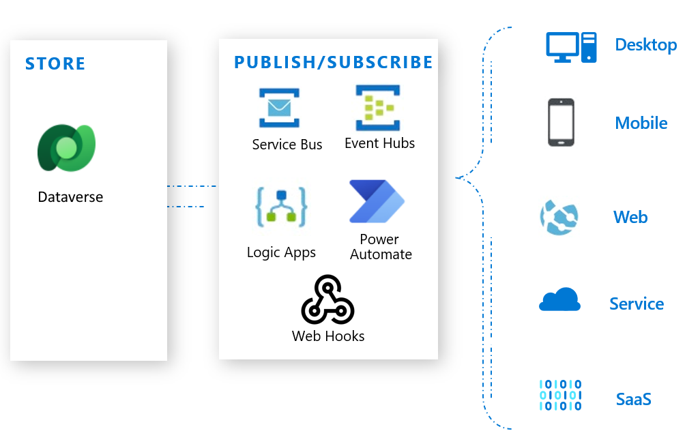
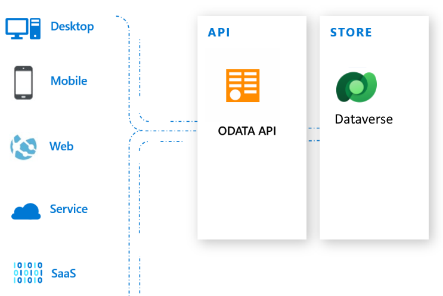
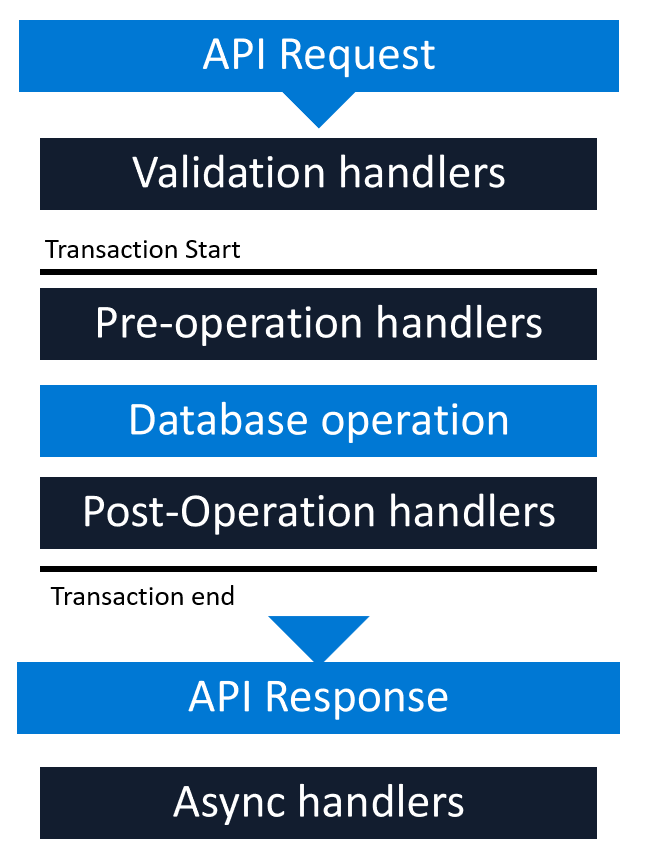
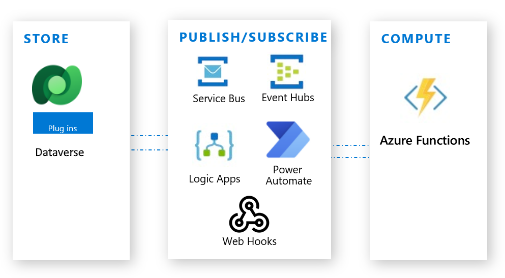

# Integrazioni con altre applicazioni

Microsoft Dataverse fornisce **diversi modi di integrazione** in qualsiasi tipo di app: dispositivo mobile, Web, desktop, dispositivo, sistema o servizio. 

Per le soluzioni cloud, esistono modi diversi per integrarsi indipendentemente dal modello in cui viene distribuita la soluzione: **infrastruttura distribuita come servizio** (IaaS), **piattaforma distribuita come servizio** (PaaS) o **software distribuito come servizio** (SaaS). 

In alcuni casi, l'integrazione con un'app può essere ottenuta utilizzando la logica di business contenuta in Dataverse. In altri casi, comporterà l'**integrazione tramite eventi**, **l'API OData** di Dataverse o utilizzando **plug-in**.

**Integrazione con le app utilizzando eventi**

Un approccio comune all'integrazione delle app è **attraverso l'uso di eventi**. Ad esempio, un evento come l'aggiunta di un nuovo record si verifica in Dataverse e questo deve essere comunicato a un sistema associato in modo da poter intraprendere un'azione. Ad esempio, se viene generata una nuova richiesta di supporto, è possibile che un messaggio SMS venga inviato al personale di supporto assegnato. 

Questa interattività può anche verificarsi nella direzione opposta: un aggiornamento in un sistema esterno potrebbe comportare l'aggiunta, l'aggiornamento o l'eliminazione di dati da un ambiente Power Platform.

Gli approcci più popolari in Dataverse comportano **webhook**, **messaggistica di Azure** (bus di servizio, hub eventi), **app per la logica di Azure** o **Power Automate**.

### Webhook

Un webhook è un semplice **modello HTTP** per il **collegamento di API e servizi Web** a un modello di pubblicazione/abbonamento. I mittenti webhook informano i destinatari sugli eventi **inoltrando richieste agli endpoint** dei destinatari con alcune informazioni sugli eventi.

- I webhook sono **scalabili** solo nella misura in cui il servizio web ospitato può gestire i messaggi.

- I webhook consentono **passaggi sincroni** e **asincroni**.

- I webhook inviano **richieste POST** con il **payload JSON** e possono essere utilizzati da qualsiasi linguaggio di programmazione o app Web ospitata ovunque.

- I webhook possono essere **richiamati da un plug-in** o un'**attività flusso di lavoro personalizzata**.

### Busi di servizio di Azure

Il bus di servizio fornisce un **canale di comunicazione sicuro e affidabile tra i dati** di runtime di Dataverse e app line-of-business esterne basate su cloud. La sequenza delgi eventi è la seguente:

- Un'**app del listener** è registrata su un endpoint della soluzione bus di servizio e inizia ad ascoltare attivamente aspettando di rilevare il contesto di esecuzione remoto di Dataverse sul bus di servizio.

- Un utente esegue un'operazione in Dataverse che **attiva l'esecuzione del plug-in** predefinito registrato o di un plug-in personalizzato in grado di riconoscere Azure. Il **plug-in avvia**, tramite un processo di sistema del servizio asincrono, un **inserimento del contesto dei dati di richiesta corrente** al bus di servizio.

- Le **attestazioni inserite** da Dataverse **vengono autenticate**. Il **bus di servizio inoltra** quindi il **contesto** di esecuzione remoto al listener. Il **listener** elabora le informazioni sul contesto ed **esegue un' attività correlata** all'azienda con tali informazioni. Il **bus di servizio notifica** al servizio asincrono il **completamento corretto** dell'inserimento e imposta lo **stato** del processo di sistema correlato su **Completato**.

### Integrazione di Dataverse nelle app con l'API OData

Tutti i linguaggi di programmazione più diffusi supportano una forma di integrazione con **API basate su REST**. 

L'API Web implementa la versione **4.0 di OData** (Open Data Protocol), che è uno standard OASIS per la creazione e l'utilizzo di API RESTful in origini dati complete. 

Dataverse adotta un approccio "**prima l'API**". Ciò significa che il servizio non fornisce solo un meccanismo per eseguire query sui dati, ma anche metadati del servizio su regole di business, vincoli e così via che è possibile utilizzare per creare app e servizi intelligenti e reattivi.

L'**API** è **protetta** con **OAuth**. OAuth richiede un provider idtable per l'autenticazione. Per Dataverse, il provider idtable è Microsoft Entra ID.

### Plug-in

Dataverse offre la **possibilità di scrivere codice compreso tra l'API e i dati**. Questo codice, scritto in .NET, è **denominato plug-in**. Poiché il plug-in si trova tra l'API e i dati, applica la stessa logica su ogni app.

I **plug-in** possono essere **sincroni** o **asincroni** ed eseguire le seguenti attività:

- Restituire errori all'utente.

- Eseguire query sui dati di Dataverse per valutare la logica da eseguire.

- Eseguire operazioni di dati.

- Eseguire richieste HTTP in uscita.

I plug-in sono registrati nei passaggi della pipeline degli eventi, illustrati qui.

### Funzioni di Azure

Funzioni di Azure offre un'opzione di esecuzione del codice serverless per la logica di business e di integrazione.

Le **funzioni** sono **attivate tramite una chiamata** da un sistema, servizio o codice esterno. Per Dataverse, tale attivazione può provenire direttamente da Dataverse utilizzando il bus di servizio, un webhook o una chiamata da un plug-in. Inoltre, la chiamata di Funzioni di Azure può essere avviata tramite un flusso in App per la logica o Power Automate che coinvolge il connettore di Dataverse.

## Link

- [Utilizzare qualsiasi tipo di app](https://learn.microsoft.com/it-it/power-apps/maker/data-platform/work-with-any-type-app)

- [Integrazione app usando eventi](https://learn.microsoft.com/it-it/power-apps/maker/data-platform/work-with-any-type-app#integrazione-con-le-app-utilizzando-eventi)

- [Integrazioni Power Apps](https://kumavision.com/it/blog/was-sind-microsoft-power-apps)

